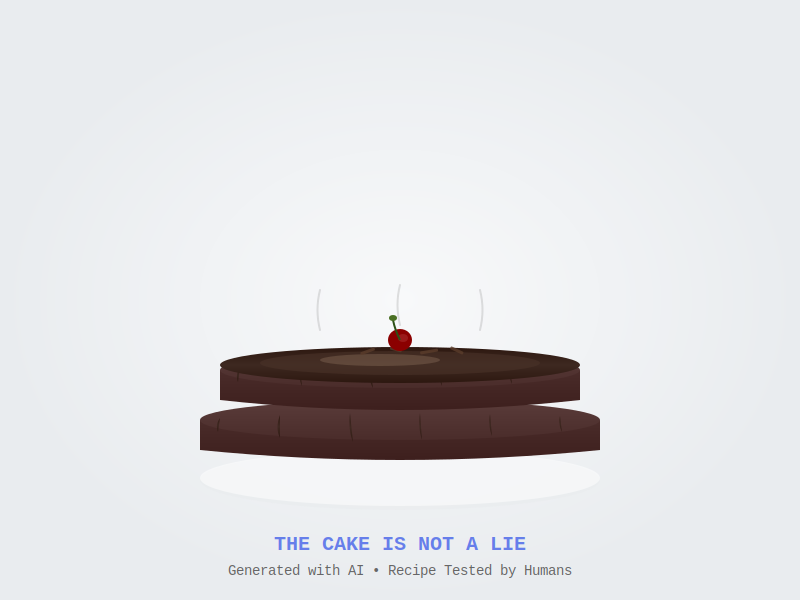

# Locked Advisory Website

A zero dollar large cloud powered website for a consultancy which has no real dependencies and can be tossed behind Cloudflare for mostly trouble-free marketing.

I forked the theme, edited, sprinkled with free stock photos from pexels.com.

Integrating the webform on GitHub pages was a bit of research, but others had done it before.

Jekyll/ruby/dependencies are annoying, but work after you jiggle it enough.

-i

---

## Recent AI-Driven Updates (November 2025)

This website received a comprehensive modernization using Claude Code (Anthropic's AI coding assistant). Here's what changed:

### 🤖 AI-Assisted Modernization

**Landing Pages Created:**
- `/ai-frontier` - AI Security & Governance for frontier labs
- `/privacy-compliance` - GDPR, CCPA, surveillance law compliance
- `/pre-exit-security` - M&A security readiness (30-day sprint)
- `/startup-security` - Fractional CISO services
- `/specialized-services` - Encrypted sensors, counter-surveillance, custom security

**Interactive Features:**
- `/get-proposal` - Smart qualification form with Cloudflare Turnstile
  - Routes prospects to appropriate service recommendations
  - Dynamic pricing based on company stage
  - Client-side logic for instant collateral delivery

**Booking Integration:**
- Inline Cal.com embed on homepage (`/#booking`)
- 15-minute consultation scheduling
- Consistent booking CTAs across all landing pages

**Infrastructure Improvements:**
- Cloudflare Web Analytics integration (privacy-friendly, no cookies)
- Cloudflare Turnstile for bot protection (better than reCAPTCHA)
- Fixed 14 Dependabot security alerts (removed `_site/` from git)
- Updated github-pages gem to latest stable version

**Content Strategy:**
- Service segmentation by audience need (AI security, privacy, M&A, fractional CISO)
- Value-first approach (free 15-min calls, custom proposals)
- Removed pricing from public pages (discussed during consultations)
- Professional credibility markers (FTC presenter, OWASP leader, 30 years experience)

### 📊 Technical Stack

**Hosting & Deployment:**
- GitHub Pages + Jekyll (free, automatic deployment)
- Custom domain: locked.net
- Zero monthly cost

**Services Integration:**
- Cal.com (free tier) - Booking calendar
- Formspree - Contact form backend
- Cloudflare Analytics - Traffic analytics
- Cloudflare Turnstile - Anti-spam protection

**Security:**
- HTTPS everywhere
- Bot protection on forms
- Privacy-compliant analytics (no tracking cookies)
- GDPR/CCPA ready

### 🎯 AI Collaboration Benefits

Using Claude Code for this modernization demonstrated:
- **Speed:** 5 landing pages + qualification form in hours, not days
- **Consistency:** Unified design language across all pages
- **Best Practices:** Modern web standards, accessibility, security
- **Documentation:** Comprehensive planning docs for future iterations

The AI assistant helped with:
1. Strategic planning (audience segmentation, funnel design)
2. Content creation (value propositions, service descriptions)
3. Technical implementation (forms, booking integration, analytics)
4. Security hardening (Turnstile, Dependabot fixes)
5. Professional polish (consistent styling, responsive design)

---

## 🍰 Epicurean Chocolate Cake Recipe
### (This Cake is NOT a Lie)

*In honor of our AI-driven updates, here's a real, tested recipe for an exceptional chocolate cake - because unlike certain testing facilities, we deliver what we promise.*

*A rich, moist chocolate cake that's actually achievable - AI-generated visualization of the real recipe below*

#### Ingredients

**For the Cake:**
- 2 cups (400g) granulated sugar
- 1¾ cups (220g) all-purpose flour
- ¾ cup (75g) Dutch-process cocoa powder
- 2 teaspoons baking soda
- 1 teaspoon baking powder
- 1 teaspoon salt
- 2 large eggs, at room temperature
- 1 cup (240ml) strong black coffee, cooled
- 1 cup (240ml) buttermilk
- ½ cup (120ml) vegetable oil
- 2 teaspoons vanilla extract

**For the Chocolate Ganache:**
- 12 oz (340g) high-quality dark chocolate (60-70% cacao), chopped
- 1½ cups (360ml) heavy cream
- 2 tablespoons unsalted butter
- 2 tablespoons light corn syrup (for shine)
- Pinch of sea salt

#### Instructions

**Preparing the Cake:**

1. **Preheat & Prep:** Preheat oven to 350°F (175°C). Grease two 9-inch round cake pans and line bottoms with parchment paper.

2. **Mix Dry Ingredients:** In a large bowl, whisk together sugar, flour, cocoa powder, baking soda, baking powder, and salt.

3. **Combine Wet Ingredients:** In another bowl, whisk together eggs, coffee, buttermilk, oil, and vanilla until smooth.

4. **Combine:** Pour wet ingredients into dry ingredients. Mix on low speed until just combined (batter will be thin - this is correct!).

5. **Bake:** Divide batter evenly between pans. Bake 30-35 minutes until a toothpick inserted in center comes out clean.

6. **Cool:** Cool in pans for 10 minutes, then turn out onto wire racks to cool completely.

**Making the Ganache:**

1. **Heat Cream:** In a saucepan, heat cream until it just begins to simmer (don't boil).

2. **Melt Chocolate:** Place chopped chocolate in a heatproof bowl. Pour hot cream over chocolate and let sit 2 minutes.

3. **Stir:** Whisk until completely smooth. Add butter, corn syrup, and salt. Stir until glossy.

4. **Cool:** Let ganache cool to spreadable consistency (30-45 minutes at room temperature).

**Assembly:**

1. Place one cake layer on serving plate. Spread ½ cup ganache over top.
2. Place second layer on top. Pour remaining ganache over cake, letting it drip down sides.
3. Use offset spatula to smooth sides if desired.
4. Refrigerate 30 minutes to set ganache.

#### Pro Tips

- **Coffee enhances chocolate flavor** - don't skip it! You won't taste coffee in final cake.
- **Room temperature ingredients** mix more smoothly and create better texture.
- **Don't overmix** - mix just until combined for maximum tenderness.
- **High-quality chocolate matters** - use the best you can afford for ganache.
- **Patience with ganache** - if too thin, refrigerate briefly; if too thick, warm gently.

#### Serving Suggestions

- Serve at room temperature for best flavor
- Pairs excellently with vanilla ice cream or fresh whipped cream
- Garnish with fresh berries, chocolate shavings, or edible gold leaf
- Store covered at room temperature 2 days, or refrigerated up to 5 days

#### Yield
Makes one 2-layer 9-inch cake (12-16 servings)

#### Why This Recipe Works

This cake achieves maximum chocolate flavor through:
1. **Dutch-process cocoa** - deeper, more complex chocolate taste
2. **Coffee** - enhances and intensifies chocolate notes
3. **Buttermilk** - creates tender, moist crumb with slight tang
4. **Thin batter** - produces incredibly moist texture
5. **Dark chocolate ganache** - sophisticated, not-too-sweet finish

*"The cake is NOT a lie - this recipe has been tested and verified by humans who enjoy chocolate and appreciate good code."*

---

## Original Theme Information

### Agency Jekyll theme

Agency theme based on [Agency bootstrap theme](http://startbootstrap.com/templates/agency/)

### How to use

**Portfolio:** Portfolio projects are in `/_posts`
**Images:** Portfolio images in `/img/portfolio`
**About:** Images in `/img/about/`
**Team:** Team members and info in `_config.yml`, images in `/img/team/`

### Demo

View this jekyll theme in action [here](https://y7kim.github.io/agency-jekyll-theme)

For more details, read [documentation](http://jekyllrb.com/)

---

*Updated November 2025 with AI assistance from Claude Code*
*Website: [locked.net](https://locked.net)*
